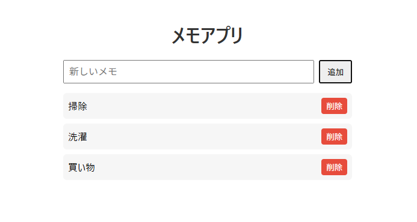

# 📝 メモアプリ (Express + React + TypeScript)

## 📖 概要
シンプルなメモを追加・削除できるサンプルアプリです。  
バックエンドは **Express (TypeScript)**、フロントエンドは **React (Vite + TypeScript)** で構成されています。



---

## 🧩 構成

```
memo-app/
 ├── backend/ # Express API
 │ ├── src/
 │ │ ├── index.ts # エントリポイント 
 │ │ ├── routes/ 
 │ │ │ └── notes.ts # メモAPIルート 
 │ │ └── types/ 
 │ │ └── note.ts # 型定義 
 │ ├── package.json 
 │ └── tsconfig.json 
 └── frontend/ # React + Vite フロントエンド 
  ├── src/ 
  │ ├── App.tsx 
  │ ├── App.css 
  │ └── main.tsx 
  ├── index.html 
  ├── vite.config.ts 
  └── package.json
```


---

## ⚙️ 使用技術

| 分類 | 技術 |
|------|------|
| 言語 | TypeScript |
| サーバー | Express.js |
| フロントエンド | React (Vite) |
| 通信 | Fetch API |
| ツール | Postman（APIテスト） |

---

## 🚀 機能

- メモ一覧取得（GET `/api/notes`）
- メモ追加（POST `/api/notes`）
- メモ削除（DELETE `/api/notes/:id`）
- シンプルなUIで操作可能（React）

---

## 🧭 セットアップ手順

### ① サーバー (Express API)

```bash
cd server
npm install
npm run dev
```
> デフォルトで http://localhost:3000 に起動します。
> 
```bash
② フロントエンド (React + Vite)
cd client
npm install
npm run dev
```
> デフォルトで http://localhost:5173 にアクセスできます。
> 

## 動作確認

1. サーバーとフロントの両方を起動する
2. ブラウザで http://localhost:5173/ を開く
3. 既存メモが一覧で表示される（GET）
4. テキストを入力して「追加」を押す（POST）
5. 「削除」ボタンを押すと対象メモが削除される（DELETE）
